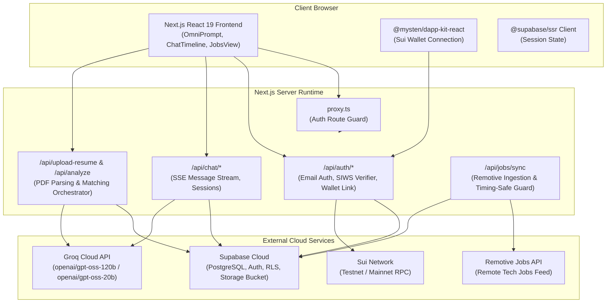

# Finder

> **AI-Powered Career Intelligence Platform & Job Portal**

Finder is an open-source platform that analyzes candidate resumes, extracts structured career profiles, and recommends matching job opportunities through an interactive, chat-first workspace.

Unlike traditional job boards that require users to search through raw keyword listings, Finder acts as a personal AI career advisor. Candidates upload their resume (PDF), which the system analyzes using Groq-accelerated models (`openai/gpt-oss-120b`, fallback `openai/gpt-oss-20b`). The platform identifies core strengths, detects skill gaps, curates matching active jobs via a resilient two-stage matching pipeline, and provides an interactive Career Copilot for technical interview preparation.

---

## Key Features

- **Document Parsing & Text Extraction**: Drag-and-drop PDF resume upload with magic bytes verification (`%PDF-`), text extraction via `pdf-parse`, and storage in private Supabase buckets.
- **AI Candidate Profiling**: Structured profile extraction powered by Groq (`openai/gpt-oss-120b` / Prompt v2.1.0, fallback `openai/gpt-oss-20b`) into candidate skills, experience, education, and career level.
- **Two-Stage Job Matching Engine**:
  - _Stage 1 (Deterministic)_: SQL skill-overlap pre-filter (limit 25) + weighted pre-ranking (Core: 2.0x, Supporting: 1.2x, General: 1.0x) to select the top 5 candidates.
  - _Stage 2 (AI Evaluation)_: Groq LLM qualitative fit evaluation, with an automated fallback formula (`55 + overlapRatio * 35`) for HTTP 429/503 resilience.
- **Conversational Career Copilot**: Real-time multi-turn career consulting streaming via Server-Sent Events (SSE), pre-grounded with candidate strengths and active job requirements.
- **Job Discovery & Detail Drawer**: Curated job listings view with interactive match level, experience, and location filters, paired with an accessible WAI-ARIA detail drawer.
- **Dual Authentication (Web2 + Web3)**:
  - Standard email and password authentication with Supabase SSR session cookies.
  - Cryptographic **Sign-In with Sui (SIWS)** personal message verification with in-memory challenge nonces and synthetic account abstraction.
  - Sui Wallet linking and unlinking with unique address constraints.
- **Automated External Job Ingestion**: Scheduled job synchronization from Remotive API secured with timing-safe constant-time secret comparison.

---

## Tech Stack

| Layer                     | Technologies                                                                                                                                                             |
| :------------------------ | :----------------------------------------------------------------------------------------------------------------------------------------------------------------------- |
| **Frontend Framework**    | [Next.js 16 (App Router)](https://nextjs.org), [React 19](https://react.dev)                                                                                             |
| **Styling & Components**  | [Tailwind CSS 4](https://tailwindcss.com), [Base UI](https://base-ui.com), [Lucide React](https://lucide.dev), [Sonner](https://sonner.emilkowal.ski)                    |
| **Backend & Runtime**     | Next.js Server & Edge Route Handlers, Node.js 22                                                                                                                         |
| **Database & Auth**       | [Supabase](https://supabase.com) (PostgreSQL 15+, Row Level Security, Auth SSR)                                                                                          |
| **AI / LLM Acceleration** | [Groq SDK](https://console.groq.com) (`openai/gpt-oss-120b`, fallback `openai/gpt-oss-20b` — [Active Models](https://console.groq.com/docs/models))                      |
| **Web3 Blockchain**       | [@mysten/sui](https://sdk.mystenlabs.com/typescript), [@mysten/dapp-kit-react](https://sdk.mystenlabs.com/dapp-kit), [@tanstack/react-query](https://tanstack.com/query) |
| **Testing & Tooling**     | [Vitest 5](https://vitest.dev), ESLint 9, TypeScript 6                                                                                                                   |

---

## System Architecture



---

## Prerequisites

- **Node.js**: `22.x` or later. Verify with:
  ```bash
  node -v
  ```
- **npm**: `10.x` or later.
- **Supabase Account**: A Supabase project with PostgreSQL database and Storage.
- **Groq API Key**: Free API key from [Groq Console](https://console.groq.com). For active model choices, see [Groq Supported Models](https://console.groq.com/docs/models).

---

## Quick Start

### 1. Clone & Install Dependencies

```bash
git clone https://github.com/DafinCi/Finder.git
cd Finder
npm install
```

### 2. Configure Environment Variables

Copy `.env.example` to `.env.local`:

```bash
cp .env.example .env.local
```

Fill in your configuration:

```env
# Supabase
NEXT_PUBLIC_SUPABASE_URL=https://your-project.supabase.co
NEXT_PUBLIC_SUPABASE_ANON_KEY=your_anon_key
SUPABASE_SERVICE_ROLE_KEY=your_service_role_key

# Groq AI (Active models: https://console.groq.com/docs/models)
GROQ_API_KEY=gsk_your_groq_api_key
GROQ_MODEL=openai/gpt-oss-120b
GROQ_FALLBACK_MODEL=openai/gpt-oss-20b
GROQ_MAX_TOKENS=2500

# Application Base URL
NEXT_PUBLIC_SITE_URL=http://localhost:3000

# Sui Web3 Network
NEXT_PUBLIC_SUI_NETWORK=testnet

# Cron Sync Secret (optional in development)
CRON_SECRET=your_cron_secret
```

### 3. Setup Database & Storage

1. In your Supabase project dashboard, open the **SQL Editor**.
2. Run [`src/database/schema_v2.sql`](src/database/schema_v2.sql) to create all tables, indexes, RLS policies, and seed data.
3. Run [`src/database/triggerAuth.sql`](src/database/triggerAuth.sql) to create the automated profile trigger.
4. In the **Storage** dashboard, create a private bucket named **`resumes`**.

### 4. Start Development Server

```bash
npm run dev
```

Open [http://localhost:3000](http://localhost:3000) in your browser.

---

## Available Scripts

| Command                           | Purpose                                                     |
| :-------------------------------- | :---------------------------------------------------------- |
| `npm run dev`                     | Start Next.js development server on `http://localhost:3000` |
| `npm run build`                   | Verify and build production bundle                          |
| `npm run start`                   | Start Next.js production server                             |
| `npm run lint`                    | Run ESLint code quality checks                              |
| `npx tsc --noEmit`                | Execute static TypeScript type checking                     |
| `npm run test:unit`               | Run hermetic unit tests (120 tests)                         |
| `npm run test:integration:mocked` | Run hermetic mocked integration tests (53 tests)            |
| `npm run test:integration:live`   | Run live Supabase integration tests (requires test DB)      |
| `npm run test:coverage`           | Run full test suite with V8 code coverage report            |

---

## Project Structure

```text
Finder/
├── .github/
│   ├── workflows/             # GitHub Actions CI & Discord notification pipelines
│   └── ISSUE_TEMPLATE/        # Bug report and feature request templates
├── docs/                      # Architectural, API, and database specifications
│   ├── architecture/          # System architecture & matching engine deep-dives
│   ├── api/                   # API route handlers reference
│   ├── database/              # Schema ERD, RLS policies, and triggers
│   └── development/           # Setup and testing guides
├── src/
│   ├── app/                   # Next.js App Router (Layouts, Pages, and API routes)
│   │   ├── (app)/             # Authenticated workspace routes (/, /c/[id], /jobs, /settings)
│   │   ├── (auth)/            # Auth routes (/login, /register)
│   │   └── api/               # 13 REST and SSE API route handlers
│   ├── components/            # Reusable UI widgets and application shell
│   ├── contexts/              # React context providers (Sidebar, etc.)
│   ├── database/              # SQL schemas, migration scripts, and auth triggers
│   ├── features/              # Feature-based domain slices
│   │   ├── ai-analysis/       # Resume extraction, orchestrator, summary cards
│   │   ├── auth/              # Email authentication hooks and forms
│   │   ├── chat/              # Timeline, omni-prompt, message dispatch, SSE parser
│   │   ├── jobs/              # Jobs view, filters, drawer, Remotive ingestion client
│   │   └── sui/               # Web3 wallet connection and SIWS linking cards
│   ├── lib/                   # Infrastructure clients (Supabase, Groq, Sui, Rate Limiter)
│   ├── types/                 # TypeScript interfaces (candidate, chat, database)
│   └── proxy.ts               # Supabase SSR auth route guard middleware
└── test/                      # 3-tier Vitest test suites
    ├── unit/                  # Hermetic unit tests
    ├── integration/mocked/    # Hermetic mocked integration tests
    ├── integration/live/      # Live Supabase integration tests
    └── mocks/                 # In-memory Supabase and Groq mock adapters
```

---

## Documentation Sitemap

- [**System Architecture**](docs/architecture/system-architecture.md)
- [**Job Matching Engine**](docs/architecture/matching-engine.md)
- [**API Reference**](docs/api/endpoints.md)
- [**Database Schema & RLS**](docs/database/schema-and-rls.md)
- [**Local Development Setup**](docs/development/setup.md)
- [**Testing Strategy & Quality Gates**](docs/development/testing.md)
- [**Coding Standards**](docs/coding-standards.md)
- [**Design System**](docs/design-system.md)
- [**Product Roadmap**](docs/roadmap.md)
- [**Security Policy**](SECURITY.md)

---

## Contributing

We welcome contributions! Please review our [**Contributing Guide**](CONTRIBUTING.md) and [**Code of Conduct**](CODE_OF_CONDUCT.md) before submitting pull requests.

---

## License

This project is licensed under the [MIT License](LICENSE).
