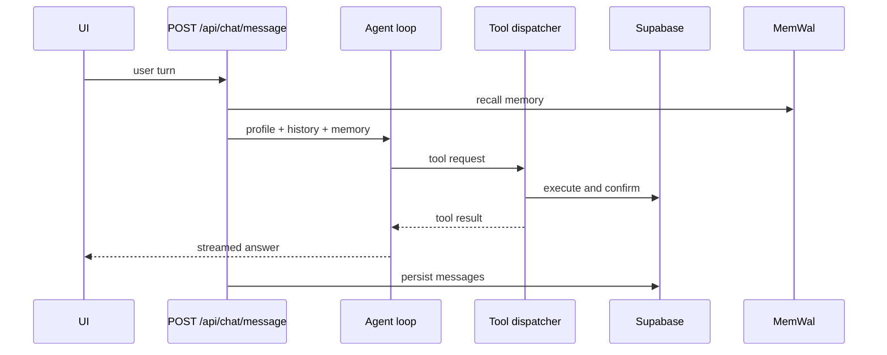

# Agent

The agent is the assistant behind `POST /api/chat/message`. It answers using the
Career Profile, recent chat context, and durable Career Memory, and it can request
Agent Tools.

## Flow

## Behavior rules

- The loop is bounded. A run stops after a limited number of tool rounds instead
  of looping indefinitely.
- A tool result is the only evidence that an action happened. The agent may not
  claim a save, a memory write, or a profile change that the backend did not
  confirm.
- Malformed tool arguments produce a structured failure that is fed back to the
  model, not a crash.
- If the primary model fails with 429 or 503, one retry happens on the fallback
  model. If both fail, the request fails with a safe message.
- Memory recall failures degrade to an answer without memory context rather than
  breaking the chat.

## Context the agent receives

- Canonical Career Profile facts.
- Recent conversation turns within a token budget.
- Recalled Career Memory, filtered against the canonical database.

## Related

- [tools.md](tools.md)
- [memory.md](memory.md)
- [../api/chat.md](../api/chat.md)
- [../architecture/failure-semantics.md](../architecture/failure-semantics.md)
