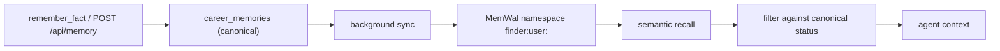

# Memory

Career Memory lets the agent remember durable facts about a candidate across
sessions. The canonical record lives in Postgres; Walrus through MemWal provides
semantic retrieval and durability.

## Architecture

## Rules

- A memory is written to the database first. The database is canonical.
- Recall is filtered so a memory marked forgotten or superseded never reappears,
  even if MemWal still returns it.
- An overlapping memory of the same category supersedes the older one instead of
  creating a duplicate.
- Confidence starts low and rises one step when the user marks an answer helpful.
- Memory content is encrypted by MemWal with Seal before it reaches Walrus, so the
  blob is public but the content is not readable without an authorized key.

## Persistence states

| `walrus_status` | Meaning |
| --- | --- |
| `pending` | Not confirmed on Walrus |
| `stored` | Confirmed, with a blob id |
| `failed` | The write did not succeed |

The UI must reflect these states and never show `stored` before it is true.

## Forget

Forget marks a memory forgotten in the database. It disappears from recall. It
does **not** delete the encrypted blob already written to Walrus. Permanent blob
deletion needs a separate flow that does not exist yet.

## Isolation

Each user has their own namespace, `finder:user:<profileId>`. One MemWal account
and one delegate key serve the whole application, so separation is logical, not
a separate credential per user. This is a deliberate limitation and should be
stated as such.

## Related

- [../api/memory.md](../api/memory.md)
- [../architecture/invariants.md](../architecture/invariants.md) I2, I6, I7
- [../glossary.md](../glossary.md)
