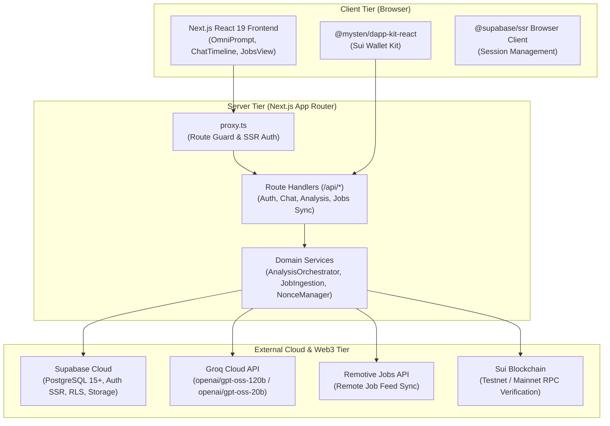

# System Architecture Overview

Finder is engineered as a modern, high-performance web application designed for AI-accelerated career intelligence and decentralized authentication.

This document serves as the high-level entry point to the system architecture. For in-depth specifications, refer to the dedicated technical deep-dives:

- [**System Architecture & Data Flows**](architecture/system-architecture.md): Complete technical breakdown of layers, sequence diagrams, and identity resolution.
- [**Two-Stage Job Matching Engine**](architecture/matching-engine.md): Comprehensive specification of the 6-stage candidate profiling, pre-ranking, and AI scoring pipeline.
- [**API Endpoints Reference**](api/endpoints.md): Request/response schemas, security middleware, and error handling for all 13 route handlers.
- [**Database Schema & RLS**](database/schema-and-rls.md): ERD, table contracts, row-level security policies, and performance indexes.

---

## High-Level Architecture Diagram

---

## Architectural Layers Summary

### 1. Presentation Tier (`src/app/`, `src/components/`, `src/features/`)

- **Framework**: Next.js 16 (App Router) with React 19 Server and Client Components.
- **Styling**: Tailwind CSS v4, Base UI primitives, and Lucide React icons.
- **State Management**: React Context (`SidebarContext`), URL search parameters for filter state, and TanStack React Query for asynchronous Sui blockchain state.

### 2. API & Security Layer (`src/app/api/`, `src/proxy.ts`)

- **Route Handlers**: Standardized JSON responses using typed helper wrappers (`createSuccessResponse`, `createErrorResponse`).
- **Auth Guard**: Edge-compatible `proxy.ts` verifying Supabase session cookies on protected routes (`/`, `/jobs`, `/settings`, `/c/*`).
- **Rate Limiting**: In-memory token bucket limiter (`src/lib/rate-limit.ts`) guarding sensitive endpoints against abuse.
- **Timing-Safe Ingestion**: Constant-time secret comparison for external cron triggers (`/api/jobs/sync`).

### 3. AI & Matching Engine (`src/lib/groq/`, `src/features/ai-analysis/`)

- **Primary Model**: `openai/gpt-oss-120b` via Groq Cloud API for ultra-fast candidate profiling and contextual matching.
- **Fallback Model**: `openai/gpt-oss-20b` for automatic recovery on HTTP 429 (rate limits) or 503 (service degradation). For all active models, see [Groq Supported Models](https://console.groq.com/docs/models).
- **Two-Stage Matching**: Deterministic SQL skill-overlap pre-filter (limit 25) followed by weighted pre-ranking and LLM qualitative scoring for the top 5 candidates.
- **Algorithmic Fallback**: Mathematical score derivation (`55 + overlapRatio * 35`) guaranteeing zero downtime if external AI APIs are unreachable.

### 4. Dual Authentication & Identity (`src/lib/sui/`, `src/features/sui/`)

- **Web2 Auth**: Standard email/password authentication via Supabase Auth SSR.
- **Web3 SIWS**: Cryptographic personal message challenge-response verification conforming to Sui standard.
- **Identity Unification**: Single Supabase `profiles` record linking an email identity with a unique Sui wallet address.

### 5. Persistence Tier (`src/database/`, Supabase PostgreSQL)

- **Tables**: 8 core tables with foreign keys and strict cascading deletes.
- **Security**: 100% Row Level Security (RLS) enforcement separating user data hermetically.
- **Storage**: Private bucket `resumes` storing uploaded PDF documents with access restricted to the document owner.
