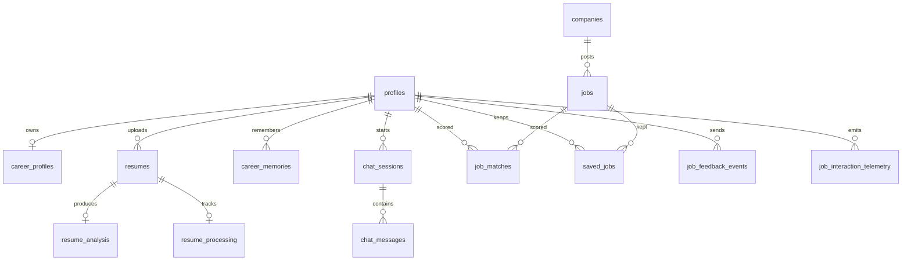

# Domain Model

## Entities

| Entity | Table | Identifier | Belongs to |
| --- | --- | --- | --- |
| Profile | `profiles` | `id` = `auth.users.id` | — |
| Career Profile | `career_profiles` | `profile_id` | Profile |
| Resume | `resumes` | `id` | Profile |
| Resume analysis | `resume_analysis` | `resume_id` | Resume |
| Resume processing state | `resume_processing` | `resume_id` | Resume |
| Career Memory | `career_memories` | `id` | Profile |
| Company | `companies` | `id` | — |
| Job | `jobs` | `id` | Company |
| Saved or rejected job | `saved_jobs` | `id` | Profile and Job |
| Match snapshot | `job_matches` | `id` | Profile and Job |
| Chat Session | `chat_sessions` | `id` | Profile |
| Chat Message | `chat_messages` | `id` | Chat Session |
| Feedback event | `job_feedback_events` | `id` | Profile |
| Interaction telemetry | `job_interaction_telemetry` | `id` | Profile |

## Relationships

## Lifecycles

**Resume processing.** `received` -> `text_extracted` -> `heuristic_checked` ->
`stored`, with terminal outcomes `needs_review`, `rejected`, or `failed`. The UI
polls this state instead of assuming completion.

**Career Memory.** `active` -> `superseded` when a newer overlapping memory of the
same category replaces it, or `active` -> `forgotten` when the user forgets it.
Neither transition deletes the Walrus blob.

**Memory persistence.** `pending` -> `stored` or `failed`. `pending` means the
write to Walrus has not been confirmed.

**Career Profile.** Draft -> confirmed. Confirmation pins `profileVersion`, which
matching and snapshots reference.

## Notes

- Exact columns and constraints are defined in `src/database/schema_v2.sql` and
  the migrations. This document stays at the concept level on purpose.
