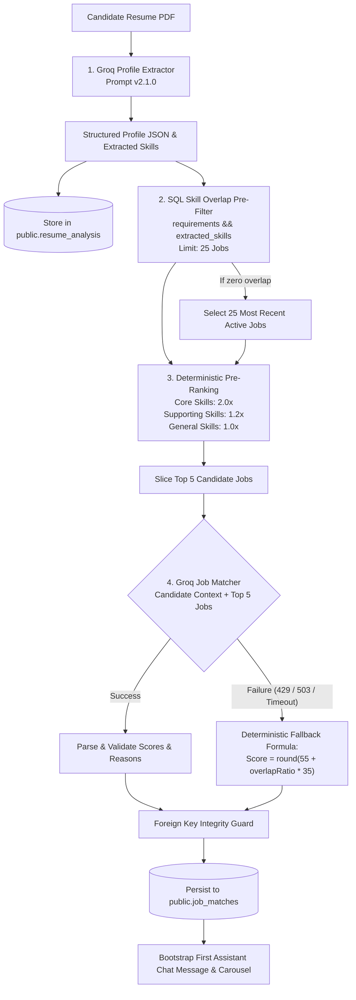

# Job Matching Engine

## Overview

The Finder Job Matching Engine is responsible for analyzing a candidate's resume, extracting a structured professional profile, and recommending the most relevant active job opportunities.

The engine uses a **two-stage matching pipeline**:

1. **Deterministic Stage**: Fast SQL skill-overlap pre-filter and weighted pre-ranking.
2. **AI Stage**: Groq LLM evaluation for deep qualitative fit analysis, with a deterministic fallback for system resilience.



---

## Detailed Pipeline Stages

### Stage 1: Candidate Profile Extraction

- **Service**: `src/lib/groq/profile-extractor.ts`
- **Model**: `openai/gpt-oss-120b` (or `GROQ_MODEL`, fallback `openai/gpt-oss-20b`). See [Groq Supported Models](https://console.groq.com/docs/models) for active models.
- **Prompt Version**: `2.1.0` (`src/lib/groq/prompts/profile-extractor.prompt.ts`)
- **Process**:
  1. The raw text extracted from the PDF (up to 15,000 characters) is passed to the LLM with a strict system prompt instructing structured extraction.
  2. The output is validated against Zod schema `extractedProfileResultSchema`.
  3. The result produces two outputs:
     - `json_profile`: Comprehensive structured profile (name, title, contact, summary, core skills, supporting skills, work history, education, career level, strengths, potential roles).
     - `extracted_skills`: Array of normalized string skill keywords.
  4. The record is persisted into `public.resume_analysis` with lineage tracking (`model_version` and `prompt_version`).

---

### Stage 2: Database Pre-Filter

- **Implementation**: [`AnalysisOrchestratorService`](../../src/features/ai-analysis/services/analysis-orchestrator.service.ts)
- **Pool Limit**: 25 candidate jobs (`DB_CANDIDATE_POOL_LIMIT = 25`).
- **SQL Logic**:
  ```sql
  SELECT id, title, description, requirements, location, job_type, salary_range, experience_level, company_name, company_id
  FROM public.jobs
  WHERE is_active = true
    AND requirements && ARRAY['skill1', 'skill2', ...]
  LIMIT 25;
  ```
- **Fallback**: If no jobs match the skill array overlap (e.g., highly niche or newly ingested skills), the system retrieves the 25 most recent active jobs to prevent a dead-end experience.

---

### Stage 3: Deterministic Pre-Ranking

To conserve LLM token budget and guarantee that the model only evaluates the most promising candidates, the system computes a deterministic pre-ranking score for each of the 25 pre-filtered jobs.

- **Weighting Rationale**:
  - `core` skills indicate the candidate's primary technical competencies (Weight: **2.0x**).
  - `supporting` skills represent secondary tools and frameworks (Weight: **1.2x**).
  - General extracted skills represent domain or tool familiarity (Weight: **1.0x**).

#### Mathematical Formula:

$$\text{PreRankingScore} = \frac{(N_{\text{core}} \times 2.0) + (N_{\text{supporting}} \times 1.2) + (N_{\text{general}} \times 1.0)}{\max(1, N_{\text{total\_requirements}})}$$

- The 25 jobs are sorted descending by `preRankingScore`.
- The top 5 jobs (`AI_MATCHING_POOL_LIMIT = 5`) are sliced for final evaluation.

---

### Stage 4: AI Job Matching & Qualitative Evaluation

- **Service**: `src/lib/groq/job-matcher.ts`
- **Context Compression**: To respect token limits (Groq TPM budget), full job descriptions are stripped. Only compact contexts are sent (`toCandidateMatchingContext` and `toJobMatchingContext`):
  - Candidate: Title, years of experience, core skills, strengths.
  - Job: Title, company, location, requirements, experience level.
- **LLM Output Schema**:
  ```json
  [
    {
      "job_id": "uuid",
      "score": 85,
      "reason": "Detailed explanation of why the candidate fits this role...",
      "missing_skills": ["Docker", "Kubernetes"]
    }
  ]
  ```

---

### Stage 5: Resilient Graceful Degradation (Fallback)

If the Groq API call fails (e.g., exhausted API limits, network disruption, or malformed JSON output after retries), the engine **does not crash or return a 500 error**. Instead, it triggers a deterministic fallback scoring formula:

#### Fallback Formula:

$$\text{overlapRatio} = \frac{N_{\text{matched\_requirements}}}{N_{\text{total\_requirements}}}$$
$$\text{Score} = \text{round}(55 + \text{overlapRatio} \times 35)$$

- **Score Range**: 55 (baseline) to 90 (perfect requirement match).
- **Reason**: Formatted automatically: `"Kecocokan dihitung berdasarkan keselarasan keahlian (X dari Y kualifikasi terpenuhi)."`
- **Missing Skills**: Dynamically derived by calculating the set difference between job requirements and candidate skills.

---

### Stage 6: Persistence & Session Bootstrapping

1. **Foreign Key Integrity Guard**: Before inserting, the engine validates that all returned `job_id` values belong to the top-5 set to prevent hallucinations.
2. **Database Save**: Valid matches are inserted into `public.job_matches`.
3. **Chat Bootstrapping**: If a `sessionId` was provided:
   - An initial assistant message is inserted into `public.chat_messages` containing rich metadata (`analysis` and `job_matches`).
   - The session title is updated to `"CV analysis: [Target Role / Candidate Title]"`.
4. **Resume Status**: Status transitions to `'completed'`.
