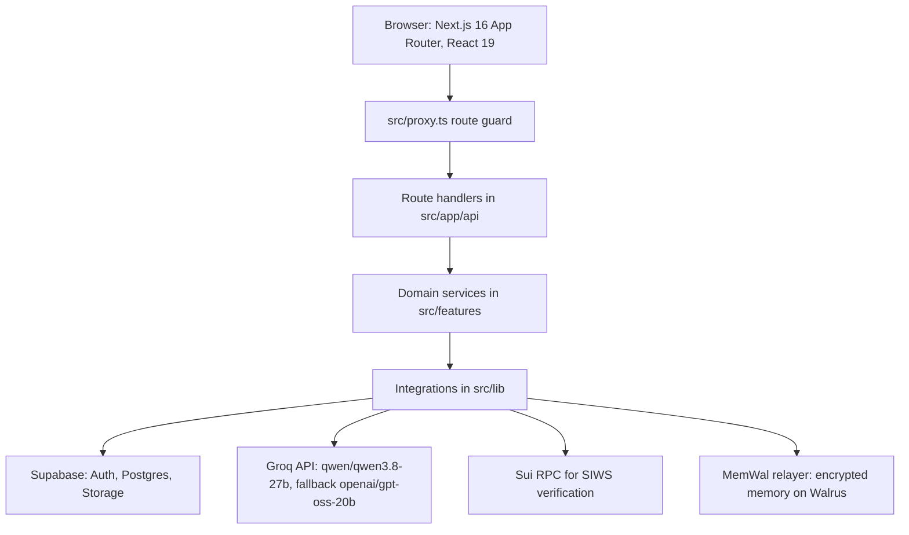

# Architecture Overview

## What Finder is

Finder is a web application that turns an uploaded resume into a structured
Career Profile, matches that profile against ingested Jobs, and keeps a
conversational agent that remembers durable career facts across sessions.

## Component map

## Layers

| Layer | Location | Responsibility |
| --- | --- | --- |
| Routes and pages | `src/app` | HTTP entry points, page shells, metadata |
| Route guard | `src/proxy.ts` | Session check and redirects for protected pages |
| Feature domains | `src/features` | Business logic per domain: profile, jobs, chat, memory, agent, ai-analysis, sui, walrus |
| Shared libraries | `src/lib` | Groq, Supabase, Sui SIWS, Walrus and MemWal, rate limiting, observability |
| Database | `src/database` | Consolidated schema, migrations, optional demo seed |

## Runtime shape

- Rendering mixes server and client components. Pages that read session state or
  browser APIs are client components.
- All data access is server-side through route handlers. The browser never talks
  to Supabase with the service role.
- The agent streams answers over Server-Sent Events from `POST /api/chat/message`.
- Long-running work, such as resume analysis and memory sync, is asynchronous and
  tracked with an explicit status row so the UI can poll instead of guessing.

## Deep dives

- [system-architecture.md](system-architecture.md) for request flows
- [domain-model.md](domain-model.md) for entities and lifecycles
- [data-ownership.md](data-ownership.md) for which system is authoritative
- [invariants.md](invariants.md) for rules that must not be broken
- [failure-semantics.md](failure-semantics.md) for degraded-path behavior
