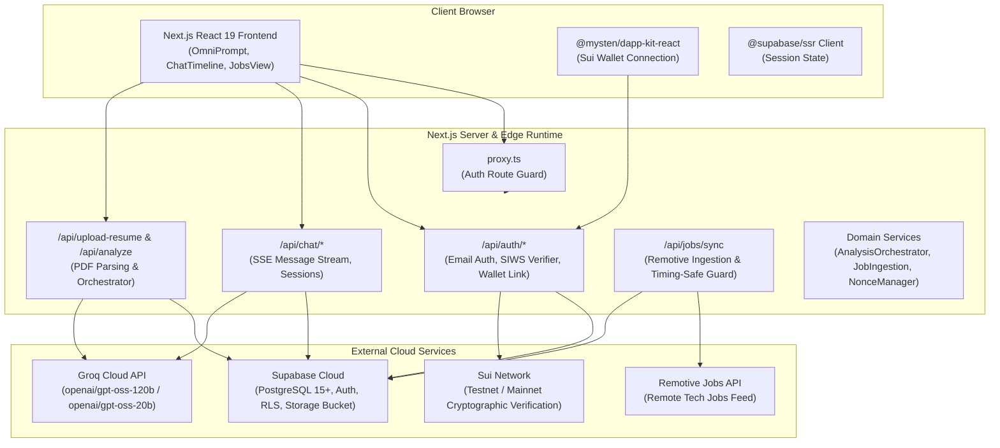
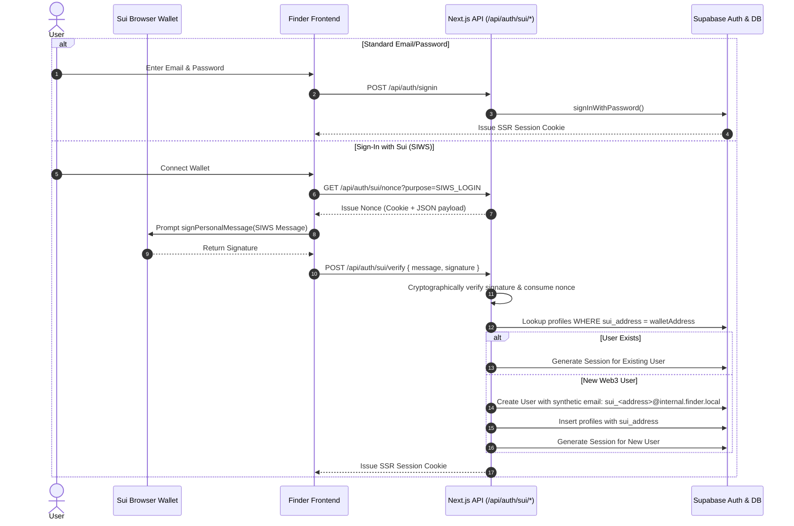

# System Architecture

## Overview

Finder is an AI-powered Career Intelligence Workspace and Job Portal built on Next.js 16 (App Router), Supabase (PostgreSQL), Groq Cloud LLM acceleration, and Sui Blockchain Web3 authentication.

Unlike traditional job boards that rely solely on keyword search, Finder is a **chat-first, candidate-centric platform**. Candidates submit their resume (PDF), which the system extracts, structures, and matches against active job listings using a resilient two-stage matching pipeline (SQL pre-filter + deterministic weighted pre-ranking + Groq LLM evaluation).

---

## Architecture Layers

### 1. Presentation Layer (Frontend)

- **Framework**: Next.js 16.2.10 App Router with React 19.2.4 Server & Client Components.
- **Routing Structure**:
  - `(auth)`: Unauthenticated routes (`/login`, `/register`).
  - `(app)`: Authenticated application workspace:
    - `/`: Home view featuring `OmniPromptInput` and quick-start action pills.
    - `/c/[id]`: Individual chat session timeline with embedded `CandidateSummaryCard` and `JobMatchCarousel`.
    - `/jobs`: Recommended job discovery interface (`JobsView`) with interactive filter toolbar and accessible WAI-ARIA detail drawer.
    - `/settings`: Account overview, identity information, and Sui wallet link/unlink card (`SuiWalletLinkCard`).
- **State Management**:
  - React Contexts: `SidebarContext` for app layout collapse state.
  - Custom Hooks: `useAuth` (Supabase auth session listener), `useChat` (SSE streaming message dispatcher), `useJobs` (matched jobs caching and filtering).
  - Web3 Context: `SuiClientProvider`, `WalletProvider` from `@mysten/dapp-kit-react` coupled with `@tanstack/react-query`.

### 2. Middleware & Request Proxy Layer

- Located at `src/proxy.ts`.
- Manages Supabase SSR session token rotation using `@supabase/ssr` cookies (`getAll` and `setAll`).
- Enforces authentication guards on protected routes: `/`, `/c/*`, `/jobs`. Unauthenticated requests to protected paths are automatically redirected to `/login`.
- Automatically redirects authenticated users away from `/login` and `/register` back to `/`.

### 3. Application & API Routing Layer

- 13 Next.js Route Handlers located under `src/app/api/`:
  - **Authentication**: `POST /api/auth/signin`, `POST /api/auth/signup`, `GET /api/auth/confirm`.
  - **Web3 SIWS**: `GET /api/auth/sui/nonce`, `POST /api/auth/sui/verify`, `POST /api/auth/sui/link`, `POST /api/auth/sui/unlink`.
  - **Chat & Copilot**: `POST /api/chat/message` (SSE streaming), `GET /api/chat/session`, `POST /api/chat/session`, `GET/PATCH/DELETE /api/chat/session/[id]`.
  - **Resume & Analysis**: `POST /api/upload-resume` (multipart PDF upload), `POST /api/analyze` (orchestrates candidate profiling and matching).
  - **Ingestion**: `POST /api/jobs/sync` (external job ingestion).

### 4. Domain Services Layer

- Located in `src/features/*/services/` and `src/lib/`:
  - `AnalysisOrchestratorService` (`src/features/ai-analysis/services/analysis-orchestrator.service.ts`): Encapsulates resume analysis, idempotency checks, atomic lock acquisition, candidate extraction, SQL pre-filtering, deterministic pre-ranking, AI matching, and chat session bootstrapping.
  - `JobIngestionService` (`src/features/jobs/services/job-ingestion.service.ts`): Orchestrates canonical job mapping, Zod schema validation, HTML description sanitization, and idempotent upsert into `public.companies` and `public.jobs`.
  - `NonceManager` (`src/lib/sui/nonce-manager.ts`): In-memory store for cryptographically secure 256-bit challenge nonces with 5-minute TTL and single-use consumption semantics.
  - `SiwsVerifier` (`src/lib/sui/siws-verifier.ts`): Cryptographic verifier for Sui personal messages using `@mysten/sui/verify`.
  - `IdentityResolver` (`src/lib/sui/identity-resolver.ts`): Manages Sui wallet identity binding, synthetic email resolution, and account linking.

### 5. Persistence & Storage Layer (Supabase PostgreSQL)

- **Relational Schema**: 8 core tables (`profiles`, `resumes`, `resume_analysis`, `companies`, `jobs`, `job_matches`, `chat_sessions`, `chat_messages`).
- **Security**: PostgreSQL Row Level Security (RLS) enabled across all tables.
- **Triggers**: `on_auth_user_created` trigger automatically provisions a `profiles` record upon Supabase user creation.
- **Storage**: Supabase Storage bucket `resumes` stores original uploaded PDF documents under path `${userId}/${timestamp}_${fileName}`.

### 6. AI & LLM Acceleration Layer (Groq)

- **Provider**: Groq Cloud API using `groq-sdk`.
- **Primary Model**: `openai/gpt-oss-120b` (configurable via `GROQ_MODEL`).
- **Fallback Model**: `openai/gpt-oss-20b` (configurable via `GROQ_FALLBACK_MODEL`).
- **Active Model Reference**: For the list of supported and active Groq models, refer to [Groq Supported Models](https://console.groq.com/docs/models).
- **Resilience Engine** (`src/lib/groq/client.ts`): Automatically catches HTTP 429 (rate limit) and HTTP 503 (service unavailable) errors, transparently executing fallback to the secondary model with structured telemetry logging.
- **Output Validation**: All LLM structured outputs are validated against Zod schemas (`src/lib/groq/schemas/`) with automated JSON repair for Markdown code fences.

---

## Authentication Architecture & Identity Resolution

Finder supports dual authentication while maintaining a unified Supabase identity:

### Wallet Linking & Unlinking

- Authenticated email users can link a Sui wallet in `/settings` via `POST /api/auth/sui/link`.
- Linking requires a valid SIWS signature with purpose `SIWS_LINK`.
- The system enforces a strict unique constraint on `profiles.sui_address`. If a wallet is already linked to another account, a `409 Conflict` is returned.
- Web3-only users (identified by their synthetic internal email domain) are blocked from unlinking their wallet to prevent orphan accounts.
