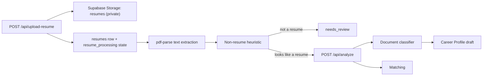

# System Architecture

## Request handling

Every request passes through `src/proxy.ts`, which refreshes the Supabase session
and redirects unauthenticated users away from protected pages (`/c`, `/jobs`,
`/profile`, `/settings`, `/onboarding`). API routes do not rely on the guard.
Each route verifies the session itself with `supabase.auth.getUser()`.

## Authentication flows

**Email and password.** `POST /api/auth/signup` and `POST /api/auth/signin` create
a Supabase session. `GET /api/auth/confirm` completes email confirmation.
Supabase writes the session cookie through `@supabase/ssr`.

**Sign-In with Sui (SIWS).** The browser requests a challenge from
`GET /api/auth/sui/nonce`. The challenge is single-use, bound to a purpose
(`SIWS_LOGIN` or `SIWS_LINK`) and to a Sui network. The wallet signs the exact
message text, the server verifies the Ed25519 signature, checks that the recovered
address matches the message address, and then bridges into a Supabase session.

**Wallet linking.** `POST /api/auth/sui/link` and `POST /api/auth/sui/unlink`
operate on the current session. A Sui address can belong to only one profile,
enforced by a unique constraint on `profiles.sui_address`.

## Resume pipeline

`GET /api/analyze/status?resumeId=...` exposes the pipeline stage so the UI can
show real progress. Rejected documents have their stored content removed.

## Matching

- Stage 1 filters Jobs by skill overlap and pre-ranks them with weighted skill
  categories.
- Stage 2 produces the final Match Score deterministically from profile evidence
  and overlap. The model never sets the score.
- `job_matches` stores a snapshot for a given profile version.

## Chat and agent

`POST /api/chat/message` streams a response over Server-Sent Events. The agent may
request Agent Tools; each request is dispatched server-side, validated, executed,
and its result is fed back to the model. Mutation tools only report success after
the backend confirms the write.

## Memory

Career Memory is written to Postgres first. A background task then mirrors it to
MemWal under the namespace `finder:user:<profileId>`. Recall reads from MemWal and
filters out anything the canonical database marks forgotten or superseded.

## Related documents

- [data-ownership.md](data-ownership.md)
- [invariants.md](invariants.md)
- [failure-semantics.md](failure-semantics.md)
- [../ai/agent.md](../ai/agent.md)
- [../integrations/walrus-memwal.md](../integrations/walrus-memwal.md)
