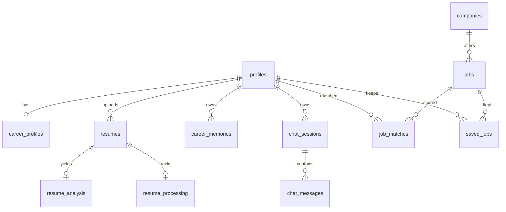

# Database and RLS

The database is PostgreSQL on Supabase. This document explains the model and its
rules. `src/database/schema_v2.sql` and the files in `src/database/migrations/`
are authoritative for exact columns, types, and constraints.

## Tables

Fourteen application tables are defined. `auth.users` is managed by Supabase.

| Table | Owner column | Purpose |
| --- | --- | --- |
| `profiles` | `id` = `auth.users.id` | Links an account to app data |
| `career_profiles` | `profile_id` | Structured career data: intent, preferences, skills, background |
| `resumes` | `profile_id` | Uploaded resume metadata and extracted text |
| `resume_analysis` | via `resume_id` | Structured analysis output for a resume |
| `resume_processing` | via `resume_id` | Pipeline stage and classification decision |
| `career_memories` | `profile_id` | Durable career facts |
| `companies` | none | Employers referenced by jobs |
| `jobs` | none | Normalized job records |
| `saved_jobs` | `profile_id` | Jobs the user saved or rejected |
| `job_matches` | `profile_id` | Match snapshot per job and profile version |
| `chat_sessions` | `user_id` | Conversation threads |
| `chat_messages` | via `session_id` | Messages inside a thread |
| `job_feedback_events` | `profile_id` | Explicit user signals |
| `job_interaction_telemetry` | `profile_id` | Implicit interaction events |

## Relationships

## Important constraints

- `profiles.sui_address` is unique, so a wallet links to at most one account.
- `jobs` keeps a unique identity per source (`source` plus `source_job_id`) so a
  re-sync updates a row instead of inserting a duplicate.
- Most user-owned tables cascade on delete from `profiles`, so removing an account
  removes its data.
- `resume_processing` and `career_profiles` reference their parent by foreign key
  and are created automatically where the flow needs them.

## Row Level Security

RLS is enabled on every user-owned table. Policies scope rows to the authenticated
identity:

- `profiles`: `auth.uid() = id`
- `resumes`, `career_profiles`, `career_memories`, `saved_jobs`, `job_matches`,
  `job_feedback_events`, `job_interaction_telemetry`: `auth.uid() = profile_id`
- `chat_sessions`: `auth.uid() = user_id`
- `chat_messages`: the session must belong to the caller

Consequences:

- The public anon key cannot read another user's rows.
- Server code that must read across users uses the service-role client, which is
  server-only and bypasses RLS.

## Lifecycle semantics

**Career Profile version.** Editing keeps a draft. Confirming pins a version.
Match snapshots reference that version, so a score is attributable to the profile
state that produced it.

**Resume processing.** Stages advance from `received` to `stored`, with terminal
outcomes `needs_review`, `rejected`, and `failed`. A rejected document has its
stored content removed.

**Career Memory.** Status is `active`, `superseded`, or `forgotten`. Superseding
happens when a newer overlapping memory of the same category replaces an older
one. Persistence to Walrus is tracked separately in `walrus_status`.

**Saved jobs.** One table holds both saved and rejected jobs, distinguished by
state, so both feed recommendation filtering.

## Indexes

Indexes exist for the columns queried on hot paths, including owner columns,
`career_memories` status and category, the per-source job identity, and job
activity. Add an index when a new query pattern becomes expensive, and update the
migration files rather than editing the database by hand.

## Related

- [../architecture/domain-model.md](../architecture/domain-model.md)
- [../architecture/data-ownership.md](../architecture/data-ownership.md)
- [../integrations/supabase.md](../integrations/supabase.md)
- [../development/change-map.md](../development/change-map.md)
