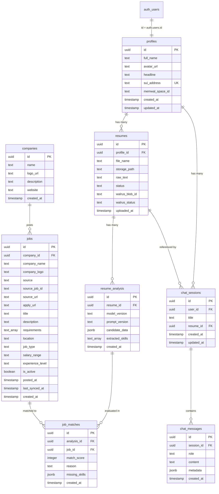

# Database Schema & Security Policies

## Overview

Finder utilizes Supabase PostgreSQL 15+ as its primary data store. The database enforces strict multi-tenant data isolation using PostgreSQL Row Level Security (RLS), referential integrity constraints, automated triggers, and optimized indexes.

The consolidated schema definition is located at `src/database/schema_v2.sql`.

---

## Entity Relationship Diagram



---

## Detailed Table Reference

### 1. `public.profiles`
Stores the user profile information bound 1:1 with `auth.users`.
- `id` (UUID, PK): References `auth.users(id)` ON DELETE CASCADE.
- `full_name` (TEXT, NOT NULL): User's display name (default `'User'`).
- `avatar_url` (TEXT): URL to profile image.
- `headline` (TEXT): Professional headline.
- `sui_address` (TEXT, UNIQUE): Linked Sui Wallet address (enforced via constraint `uq_profiles_sui_address`). Nullable to allow non-wallet users.
- `memwal_space_id` (TEXT): Placeholder for decentralized Walrus Memory space ID.

### 2. `public.resumes`
Stores metadata and parsed text for uploaded resume documents.
- `id` (UUID, PK): Default `uuid_generate_v4()`.
- `profile_id` (UUID, FK): References `public.profiles(id)` ON DELETE CASCADE.
- `file_name` (TEXT, NOT NULL): Original uploaded filename.
- `storage_path` (TEXT, NOT NULL): Supabase Storage path (`${userId}/${timestamp}_${fileName}`).
- `raw_text` (TEXT): Extracted text content from the PDF (max 15,000 characters).
- `status` (TEXT): Status enum (`'uploaded'`, `'processing'`, `'completed'`, `'failed'`).
- `walrus_blob_id` & `walrus_status`: Schema placeholders for future Walrus integration.

### 3. `public.resume_analysis`
Stores structured candidate intelligence extracted by Groq LLM.
- `id` (UUID, PK): Default `uuid_generate_v4()`.
- `resume_id` (UUID, FK): References `public.resumes(id)` ON DELETE CASCADE.
- `model_version` (TEXT): Name of LLM model used (e.g., `qwen/qwen3.8-27b`).
- `prompt_version` (TEXT): Prompt template version (e.g., `2.1.0`).
- `candidate_data` (JSONB, NOT NULL): Structured JSON profile containing candidate summary, experience array, education array, and strengths.
- `extracted_skills` (TEXT[]): Normalized array of candidate skill strings.

### 4. `public.companies`
Stores employer metadata.
- `id` (UUID, PK): Default `uuid_generate_v4()`.
- `name` (TEXT, NOT NULL): Company name.
- `logo_url` (TEXT): Company logo URL.
- `website` (TEXT): Company official website.

### 5. `public.jobs`
Stores active job listings from internal posting or external ingestion.
- `id` (UUID, PK): Default `uuid_generate_v4()`.
- `company_id` (UUID, FK): References `public.companies(id)` ON DELETE CASCADE. Nullable for ingested external jobs.
- `company_name` & `company_logo` (TEXT): De-normalized company details for fast joins.
- `source` (TEXT, NOT NULL): Origin source enum (`'manual'`, `'remotive'`, `'remoteok'`, `'jobicy'`, `'arbeitnow'`).
- `source_job_id` (TEXT): External ID from the origin provider.
- `requirements` (TEXT[]): Array of required skills/keywords used in SQL pre-filter.
- `is_active` (BOOLEAN): Flag indicating if job is currently open (Default `true`).
- **Constraint**: `uq_jobs_source_job_id UNIQUE (source, source_job_id)` guarantees idempotent upsert during sync.

### 6. `public.job_matches`
Stores the results of matching an analysis to a job opportunity.
- `id` (UUID, PK): Default `uuid_generate_v4()`.
- `analysis_id` (UUID, FK): References `public.resume_analysis(id)` ON DELETE CASCADE.
- `job_id` (UUID, FK): References `public.jobs(id)` ON DELETE CASCADE.
- `match_score` (INTEGER, NOT NULL): Score from 0 to 100.
- `reason` (TEXT): AI explanation of candidate fit.
- `missing_skills` (JSONB): Array of gap skills identified for interview prep.
- **Constraint**: `UNIQUE (analysis_id, job_id)`.

### 7. `public.chat_sessions`
Stores conversational career consulting sessions.
- `id` (UUID, PK): Default `uuid_generate_v4()`.
- `user_id` (UUID, FK): References `public.profiles(id)` ON DELETE CASCADE.
- `title` (TEXT, NOT NULL): Session title.
- `resume_id` (UUID, FK): Optional link to `public.resumes(id)` ON DELETE SET NULL.

### 8. `public.chat_messages`
Stores multi-turn conversational messages and embedded UI widget data.
- `id` (UUID, PK): Default `uuid_generate_v4()`.
- `session_id` (UUID, FK): References `public.chat_sessions(id)` ON DELETE CASCADE.
- `role` (TEXT, NOT NULL): Enum (`'user'`, `'assistant'`, `'system'`).
- `content` (TEXT, NOT NULL): Markdown message content.
- `metadata` (JSONB): Embedded widget payloads (e.g. `{ analysis: {...}, job_matches: [...] }`).

---

## Row Level Security (RLS) Policies

All tables have RLS explicitly enabled (`ALTER TABLE ... ENABLE ROW LEVEL SECURITY`).

| Table | Policy Name | Permitted Roles | Condition |
| :--- | :--- | :--- | :--- |
| `profiles` | Users can view own profile | `authenticated` | `auth.uid() = id` |
| `profiles` | Users can update own profile | `authenticated` | `auth.uid() = id` |
| `profiles` | Users can insert own profile | `authenticated` | `auth.uid() = id` |
| `resumes` | Users can view own resumes | `authenticated` | `auth.uid() = profile_id` |
| `resumes` | Users can insert own resumes | `authenticated` | `auth.uid() = profile_id` |
| `resumes` | Users can update own resumes | `authenticated` | `auth.uid() = profile_id` |
| `resume_analysis` | Users can view own analysis | `authenticated` | Via join to `resumes.profile_id = auth.uid()` |
| `companies` | Anyone can view companies | `anon`, `authenticated` | `true` |
| `jobs` | Anyone can view active jobs | `anon`, `authenticated` | `is_active = true` |
| `job_matches` | Users can view own matches | `authenticated` | Via join to `resumes.profile_id = auth.uid()` |
| `chat_sessions` | Users can manage own chat sessions | `authenticated` | `auth.uid() = user_id` |
| `chat_messages` | Users can manage own chat messages | `authenticated` | Via join to `chat_sessions.user_id = auth.uid()` |

---

## Database Triggers & Functions

### Automated User Profile Provisioning
Located in `src/database/triggerAuth.sql`:
```sql
CREATE OR REPLACE FUNCTION public.handle_new_user()
RETURNS trigger
LANGUAGE plpgsql
SECURITY DEFINER SET search_path = public
AS $$
BEGIN
  INSERT INTO public.profiles (id, full_name, avatar_url)
  VALUES (
    NEW.id,
    COALESCE(NEW.raw_user_meta_data->>'full_name', 'User'),
    NEW.raw_user_meta_data->>'avatar_url'
  )
  ON CONFLICT (id) DO UPDATE
  SET full_name = EXCLUDED.full_name,
      avatar_url = EXCLUDED.avatar_url;
  RETURN NEW;
END;
$$;

CREATE TRIGGER on_auth_user_created
  AFTER INSERT ON auth.users
  FOR EACH ROW EXECUTE FUNCTION public.handle_new_user();
```
