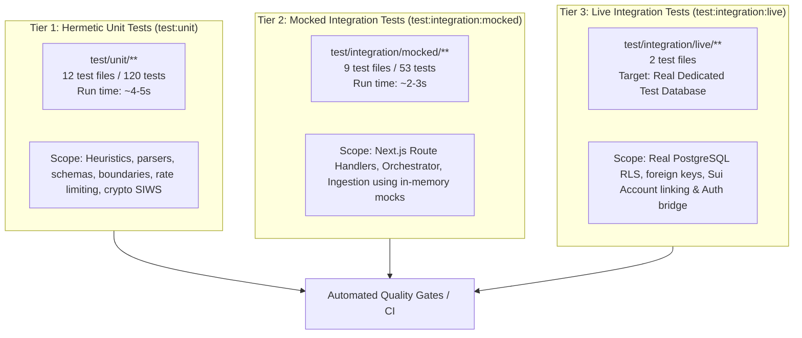

# Testing Strategy & Quality Gates

## Overview

Finder adopts a **3-tier testing architecture** using [Vitest](https://vitest.dev) to ensure high reliability, fast local feedback cycles, and hermetic CI validation.



---

## Test Commands

All test scripts are configured in `package.json`:

```bash
# 1. Run hermetic unit tests only (Fastest - recommended during active development)
npm run test:unit

# 2. Run hermetic mocked integration tests (Verifies API handlers and domain services)
npm run test:integration:mocked

# 3. Run all mocked integration tests together
npm run test:integration

# 4. Run live Supabase integration tests (Requires dedicated test database credentials)
npm run test:integration:live

# 5. Run full test suite with code coverage
npm run test:coverage
```

---

## 1. Hermetic Unit Tests (`test/unit/`)

Hermetic unit tests do not make any network requests or database connections. All external SDKs and system clocks are mocked or isolated.

### Key Test Suites:

- `canonical-job.test.ts`: Validates data mapping and transformation from raw sources into canonical job schema.
- `job-matching-context.test.ts`: Verifies context compression rules to protect Groq TPM budget.
- `prompt-boundary.test.ts`: Verifies XML prompt boundary escaping (`<untrusted_career_data>`) to prevent prompt injection.
- `rate-limit.test.ts`: Tests the sliding-window in-memory rate limiter and header responses.
- `remotive-schema.test.ts` & `remotive-adapter.test.ts`: Validates Zod validation rules against Remotive API payloads.
- `sui-siws.test.ts`: Verifies cryptographic SIWS message generation and verification against `@mysten/sui`.
- `sui-frontend-auth.test.ts`: Tests frontend wallet connection state machine and error handling.
- `ai-resilience.test.ts`: Tests transparent fallback from primary model to secondary model on HTTP 429/503.
- `title-generator.test.ts`: Tests deterministic regex title generation without LLM invocations.

---

## 2. Mocked Integration Tests (`test/integration/mocked/`)

Mocked integration tests exercise Next.js route handlers (`NextRequest` / `NextResponse`) and domain services using comprehensive in-memory mock adapters for Supabase and Groq.

### Mock Architecture:

- `test/mocks/supabase.mock.ts`: Emulates Supabase query builder (`.from()`, `.select()`, `.insert()`, `.update()`, `.delete()`, `.eq()`, `.filter()`).
- `test/mocks/groq.mock.ts`: Mocks LLM responses for candidate profiling, job matching, and streaming.
- **Coverage**:
  - `upload-resume.test.ts`: Verifies PDF magic bytes validation, storage uploads, and unauthorized session hijacking prevention.
  - `analyze.test.ts`: Tests candidate analysis API, rate limiting, and parameter validation.
  - `analysis-orchestrator.test.ts`: Tests end-to-end orchestration, idempotency caching, and fallback scoring.
  - `chat-session.test.ts` & `chat-message.test.ts`: Tests session lifecycle, tenant ownership checks, and SSE token streaming.
  - `jobs-sync-route.test.ts` & `job-ingestion.test.ts`: Tests cron authorization secrets and idempotent upsert logic.

---

## 3. Live Supabase Integration Tests (`test/integration/live/`)

Live integration tests exercise real PostgreSQL RLS policies, foreign key cascades, and unique constraints against an actual Supabase project.

### Configuration:

Live tests look for dedicated test database credentials:

```env
SUPABASE_TEST_URL=https://your-test-project.supabase.co
SUPABASE_TEST_ANON_KEY=eyJ...
SUPABASE_TEST_SERVICE_ROLE_KEY=eyJ...
```

_(If unset, tests fallback to `NEXT_PUBLIC_SUPABASE_URL`, etc.)_

> [!WARNING]
> **Never run live integration tests against a production database.**
> Live integration tests create and clean up temporary test accounts and documents. Always use a dedicated development or testing project.

---

## Quality Gates in CI/CD

Before code is merged to `develop` or `main`, GitHub Actions (`.github/workflows/test.yml`) enforces the following sequential quality gates:

1. **Static Quality Gate**:
   - `npm run lint` (ESLint 9)
   - `npx tsc --noEmit` (TypeScript strict typecheck)
   - `npm run build` (Next.js production build verification)
2. **Hermetic Test Gate**:
   - `npm run test:unit` (120 unit tests)
   - `npm run test:integration:mocked` (53 mocked integration tests)
3. **Live Test Gate**:
   - `npm run test:integration:live` (Executed when `SUPABASE_TEST_*` repository secrets are configured in GitHub Actions).
