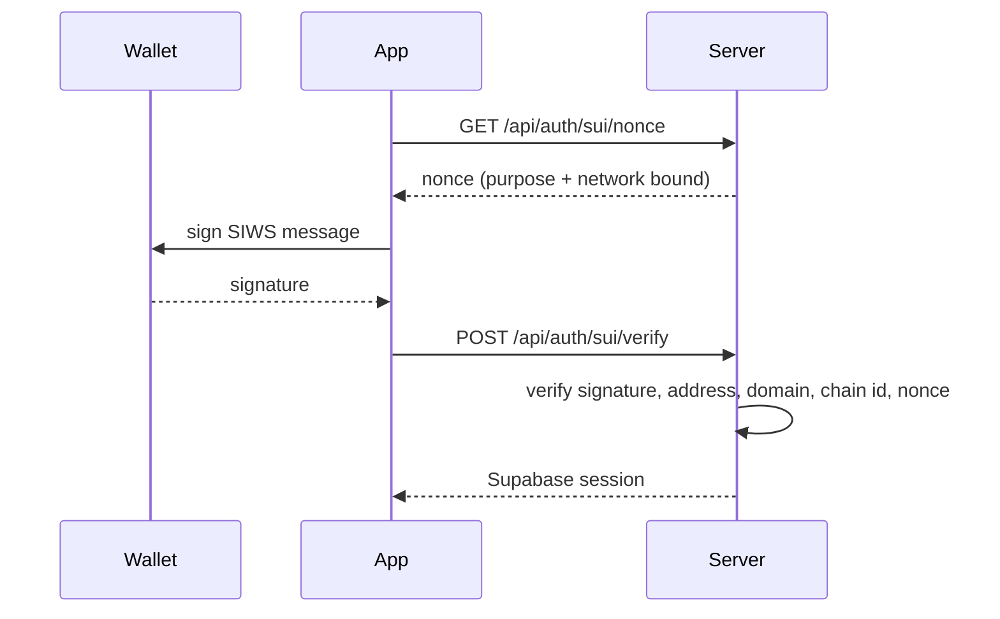

# Sui and SIWS Integration

Finder uses Sui wallets for Sign-In with Sui (SIWS) and for linking a wallet to an
account. This document covers the Finder integration. For protocol details, see
the official Sui documentation.

## Why Sui

SIWS gives users a passwordless option and connects career identity to a wallet
address. It is a signing flow only: no transaction, no gas.

## Flow

## Security properties

- The nonce is single-use and bound to both a purpose (`SIWS_LOGIN` or
  `SIWS_LINK`) and a Sui network, so it cannot be replayed across purposes or
  networks.
- The signed message includes a chain id, and the server checks it against the
  configured network.
- The recovered address from the signature must equal the address written in the
  message, so a caller cannot claim someone else's address.
- A Sui address can belong to exactly one profile.
- Signing is a personal message, so no gas is spent and no transaction is
  submitted.

## Network configuration

`NEXT_PUBLIC_SUI_NETWORK` selects the network. It defaults to `mainnet` in
production and `testnet` otherwise. The client flow and the server verifier must
agree on the value, so set it explicitly per environment and rebuild after
changing it.

## Wallet linking rules

- `POST /api/auth/sui/link` attaches a wallet to the current account.
- `POST /api/auth/sui/unlink` detaches it, and is rejected when the wallet is the
  only sign-in method.

## Related

- [../api/authentication.md](../api/authentication.md)
- [../architecture/invariants.md](../architecture/invariants.md) I1
