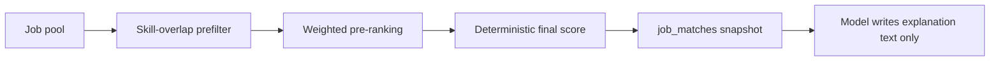

# Matching

Matching turns a Career Profile plus the job pool into ranked Recommendations
with a deterministic Match Score.

## Pipeline

## Stage 1 — prefilter and pre-rank

- Jobs are filtered by skill overlap, then pre-ranked using weighted skill
  categories: core, supporting, and general.
- The exact weights and limits live in the matching service. Treat that code as
  authoritative rather than this document.

## Stage 2 — deterministic score

The final Match Score is computed deterministically from skill overlap and profile
evidence. The model does not set or adjust it. A model may add explanation text,
but the number is reproducible for the same inputs.

## Snapshot

Results are stored in `job_matches` for a given `profileVersion`. Changing the
profile and confirming it produces a new version, so old snapshots stay
attributable to the profile state that produced them.

## Why determinism matters

- Users can trust and compare scores.
- Re-running produces the same ranking.
- A provider outage degrades explanation quality, not ranking correctness.

## Related

- [../architecture/invariants.md](../architecture/invariants.md) I3
- [../api/jobs.md](../api/jobs.md)
- [../ai/overview.md](../ai/overview.md)
